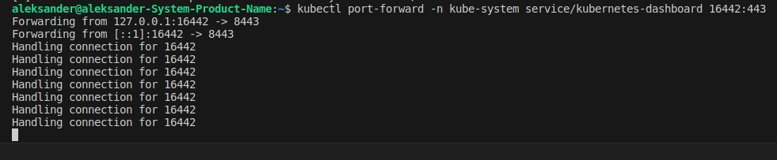

# Домашнее задание к занятию «Kubernetes. Причины появления. Команда kubectl»

### Цель задания

Для экспериментов и валидации ваших решений вам нужно подготовить тестовую среду для работы с Kubernetes. Оптимальное решение — развернуть на рабочей машине или на отдельной виртуальной машине MicroK8S.

------

### Чеклист готовности к домашнему заданию

1. Личный компьютер с ОС Linux или MacOS 

или

2. ВМ c ОС Linux в облаке либо ВМ на локальной машине для установки MicroK8S  

------

### Инструкция к заданию

1. Установка MicroK8S:
    - sudo apt update,
    - sudo apt install snapd,
    - sudo snap install microk8s --classic,
    - добавить локального пользователя в группу `sudo usermod -a -G microk8s $USER`,
    - изменить права на папку с конфигурацией `sudo chown -f -R $USER ~/.kube`.

2. Полезные команды:
    - проверить статус `microk8s status --wait-ready`;
    - подключиться к microK8s и получить информацию можно через команду `microk8s command`, например, `microk8s kubectl get nodes`;
    - включить addon можно через команду `microk8s enable`; 
    - список addon `microk8s status`;
    - вывод конфигурации `microk8s config`;
    - проброс порта для подключения локально `microk8s kubectl port-forward -n kube-system service/kubernetes-dashboard 10443:443`.

3. Настройка внешнего подключения:
    - отредактировать файл /var/snap/microk8s/current/certs/csr.conf.template
    ```shell
    # [ alt_names ]
    # Add
    # IP.4 = 123.45.67.89
    ```
    - обновить сертификаты `sudo microk8s refresh-certs --cert front-proxy-client.crt`.

4. Установка kubectl:
    - curl -LO https://storage.googleapis.com/kubernetes-release/release/`curl -s https://storage.googleapis.com/kubernetes-release/release/stable.txt`/bin/linux/amd64/kubectl;
    - chmod +x ./kubectl;
    - sudo mv ./kubectl /usr/local/bin/kubectl;
    - настройка автодополнения в текущую сессию `bash source <(kubectl completion bash)`;
    - добавление автодополнения в командную оболочку bash `echo "source <(kubectl completion bash)" >> ~/.bashrc`.

------

### Инструменты и дополнительные материалы, которые пригодятся для выполнения задания

1. [Инструкция](https://microk8s.io/docs/getting-started) по установке MicroK8S.
2. [Инструкция](https://kubernetes.io/ru/docs/reference/kubectl/cheatsheet/#bash) по установке автодополнения **kubectl**.
3. [Шпаргалка](https://kubernetes.io/ru/docs/reference/kubectl/cheatsheet/) по **kubectl**.

------

### Задание 1. Установка MicroK8S

1. Установить MicroK8S на локальную машину или на удалённую виртуальную машину.
2. Установить dashboard.
3. Сгенерировать сертификат для подключения к внешнему ip-адресу.

------

### Задание 2. Установка и настройка локального kubectl
1. Установить на локальную машину kubectl.
2. Настроить локально подключение к кластеру.
3. Подключиться к дашборду с помощью port-forward.

------

### Решение 1. Установка MicroK8S

1. Устанавливаем MicroK8S:
   - выполняем команду sudo apt update,
   - выполняем команду sudo apt install snapd,
   - выполняем команду sudo snap install microk8s --classic,
```
aleksander@aleksander-MS-7641:~$ sudo snap install microk8s --classic
microk8s (1.28/stable) v1.28.3 от Canonical✓ установлен
```
   - добавляем локального пользователя в группу `sudo usermod -a -G microk8s $USER`,
```
aleksander@aleksander-MS-7641:~$ sudo usermod -a -G microk8s aleksander
```
   - обновляем группу 
```
aleksander@aleksander-MS-7641:~$ su - aleksander
```
   - изменяем права на папку с конфигурацией `sudo chown -f -R $USER ~/.kube`.
```
aleksander@aleksander-MS-7641:~$ sudo chown -f -R aleksander ~/.kube
```
   - проверяем статус `microk8s status --wait-ready`
<p align="center">
  
</p>

2. Устанавливаем dashboard:
 - выполняем команду `microk8s enable dashboard`
<p align="center">
  
</p>

   - генерируем токен
 
```
aleksander@aleksander-MS-7641:~$ microk8s kubectl describe secret -n kube-system microk8s-dashboard-token
Name:         microk8s-dashboard-token
Namespace:    kube-system
Labels:       <none>
Annotations:  kubernetes.io/service-account.name: default
              kubernetes.io/service-account.uid: 05b24cf4-856b-4a9e-aa87-1550f58cdda5

Type:  kubernetes.io/service-account-token

Data

token:      
<<secret>>
ca.crt:     1123 bytes
namespace:  11 bytes
```

3. Генерируем сертификат для подключения к внешнему ip-адресу.

 - устанавливаем cert-manager

<p align="center">
  
</p>

 - редактируем сертификат:

 ```
 aleksander@aleksander-MS-7641:~$ sudo vim /var/snap/microk8s/current/certs/csr.conf.template
 ```

<p align="center">
  
</p>

 - обновляем сертификат:

```
aleksander@aleksander-MS-7641:~$ sudo microk8s refresh-certs --cert front-proxy-client.crt
Taking a backup of the current certificates under /var/snap/microk8s/6089/certs-backup/
Creating new certificates
Signature ok
subject=CN = front-proxy-client
Getting CA Private Key
Restarting service kubelite.
```

### Решение 2. Установка и настройка локального kubectl

1. Устанавливаем на локальную машину kubectl.
```
aleksander@aleksander-MS-7641:~$ curl -LO "https://dl.k8s.io/release/$(curl -L -s https://dl.k8s.io/release/stable.txt)/bin/linux/amd64/kubectl"
  % Total    % Received % Xferd  Average Speed   Time    Time     Time  Current
                                 Dload  Upload   Total   Spent    Left  Speed
100   138  100   138    0     0    509      0 --:--:-- --:--:-- --:--:--   511
100 47.4M  100 47.4M    0     0  2498k      0  0:00:19  0:00:19 --:--:-- 2663k
aleksander@aleksander-MS-7641:~$ sudo install -o root -g root -m 0755 kubectl /usr/local/bin/kubectl
aleksander@aleksander-MS-7641:~$ kubectl version --client
Client Version: v1.29.1
Kustomize Version: v5.0.4-0.20230601165947-6ce0bf390ce3
```
2. Настраиваем локально подключение к кластеру.
 - открываем конфигурацию `aleksander@aleksander-MS-7641:~$ sudo vim .kube/config`
 - записываем конфигурацию в файл config

```
apiVersion: v1
clusters:
- cluster:
    certificate-authority-data: LS0tLS1CRUdJTiBDRVJUSUZJQ0FURS0tLS0tCk1JSUREekNDQWZlZ0F3SUJBZ0lVRE9VTzFGR0dxU0NSTXo1UzQzNnQycnN5NXVZd0RRWUpLb1pJaHZjTkFRRUwKQlFBd0Z6RVZNQk1HQTFVRUF3d01NVEF1TVRVeUxqRTRNeTR4TUI0WERUSTBNREV5TkRBM01qSXhNVm9YRFRNMApNREV5TVRBM01qSXhNVm93RnpFVk1CTUdBMVVFQXd3TU1UQXVNVFV5TGpFNE15NHhNSUlCSWpBTkJna3Foa2lHCjl3MEJBUUVGQUFPQ0FROEFNSUlCQ2dLQ0FRRUFwQkpxZ20vZE1IemdpNVU3TkUrWEwyeitZUXFBTlBPTFQ1TG8KMStzZkJRRVU2TERPV01icW94NXN4ZWRIUVUvcm12Nnd3NTFrdnEzUFdpbzNnUHZMRUFsbFhyd3d6Y1FOaHJuTgpXNFdic0FNdEh4M3pSd2pzQ0E2ZS9GQnJ6TVVwS1JFeDFNNEtLc0JwTzYxTnhXSEZHVkdRT3RsYTZxbkNFRVJ5ClJJMnlURGRlVnJ2b1daejd5OUNmdW9mbG9QZTI1cWtwS3JGMTlJSzRxT0YwTUF6ZnRqOGFsbzZGN2FiKzB0Ri8KSkRlbDZKMHo1eEY3WXh1SnBFQmZ1UzRwNWhYclRqNzY5bGVHckxDWjcyUVVhcFFaZ1RUQnpoaUtYSkVucnhEQwpzT0tMNG1Rbjh3dDZTYU1CclpqOXlsWGdRK1l5NkdqKy9USVRkdXNBQkpxdWNCQkpHd0lEQVFBQm8xTXdVVEFkCkJnTlZIUTRFRmdRVXVkMWtieExHbnVkbjhLNzZMZlhuMWp2eVZHZ3dId1lEVlIwakJCZ3dGb0FVdWQxa2J4TEcKbnVkbjhLNzZMZlhuMWp2eVZHZ3dEd1lEVlIwVEFRSC9CQVV3QXdFQi96QU5CZ2txaGtpRzl3MEJBUXNGQUFPQwpBUUVBQWltazRmZlpZcUkyTGR0MXowVEVUV01Md2ZaRTBLNGMzaXRsa2JsejZpU2FjRWFoTWtwS2U0TXdIVkl5CkttVmYzdHM0cjluQzVjR0daZHN0dVpHY1hjVFl1eFBOemNWWWxaQTBlVEpxTkoyaUVXakg0b2wxWmM2Ym5kbGUKNElyeE0xc1J3RmlXTk40ZGZiOU5XQ0l2Q3BabUlhV2pQdUZCbVYvTVE2Nko5K0xKaUZFMHBheThTMFVZN09LUApCZDRGZ2F5RHY1Ym1ySDhYTVpIbmhzcWo4ZXRjTmZobXNnL1NZMUxjWHZ6Wkl6RXVsRjJvWlYxQXF0YjVuL04rCm13VHFOWUVabStPTElkT0FubVJtaldXWERRUjgzSlQxTkhkZHBoZ0JNQzBYSDl0bTJROFh0YW1QSzNGUG15QTQKYzZSdTVnZUd6NjFJVkJEM1hoRGxIU1dkMWc9PQotLS0tLUVORCBDRVJUSUZJQ0FURS0tLS0tCg==
    server: https://192.168.52.107:16443
  name: microk8s-cluster
contexts:
- context:
    cluster: microk8s-cluster
    user: aleksander-ms-7641
  name: microk8s
current-context: microk8s
kind: Config
preferences: {}
users:
- name: aleksander-ms-7641
  user:
    client-certificate-data: LS0tLS1CRUdJTiBDRVJUSUZJQ0FURS0tLS0tCk1JSUN6RENDQWJTZ0F3SUJBZ0lVR0M4OCtEazhqSXlsOGVVRDZmWUlOMVZFRENFd0RRWUpLb1pJaHZjTkFRRUwKQlFBd0Z6RVZNQk1HQTFVRUF3d01NVEF1TVRVeUxqRTRNeTR4TUI0WERUSTBNREV5TkRBM01qSXhNVm9YRFRNMApNREV5TVRBM01qSXhNVm93S1RFT01Bd0dBMVVFQXd3RllXUnRhVzR4RnpBVkJnTlZCQW9NRG5ONWMzUmxiVHB0CllYTjBaWEp6TUlJQklqQU5CZ2txaGtpRzl3MEJBUUVGQUFPQ0FROEFNSUlCQ2dLQ0FRRUE2VWZsNDgybEVyNWMKRm1lSUtadCtnL1JLK09rNW1sZm91WmluYTVxRHpDRXRJU1ZQTDVkS3dOUWRZbzdaQjdaQzJhbG5yN3gzNVBoSQozSS8vdFRyN3RzNjF3RWRQRW9Lb282Mk5KTTNtemtncnhGcldQQ2F6WHFPK3ZkTG1mNGViZHFHVkRmNHBpdlVuCkdPOWFLWUorOVV1WjRtb0N2QnM2a0NzeUdEYTM5Q0lsZTNzT205YjFKcjZhRFhRc2dFdWdiYlRyWm5QbGEzQ1oKamhwdU1FMVc0bXdjUzArbDdON2dSV0Zod1JLSzNDU0d6SzIwdVhpdS9oTmNMWjJ0NytkMmlhbFpubzkrdGlBegpPVXJZSzc5aWZpS3B3VTRCUVRRTThvVnB2OUlkd3FHMzh6THJ0ODZ1ZTBwbU1tcHJaS1ZhdHVkUmJ5b3RRN25HCmd3VTZLSVYwdXdJREFRQUJNQTBHQ1NxR1NJYjNEUUVCQ3dVQUE0SUJBUUJFWmNNOHZxREdFMWR6RHVzUG5SQXQKRTdxVThyR2lWM2RuY29KeVBCRExpRy9Vc3dBekFlTkVjWXZzRWVXV2V4OU53eFNGaURKUDNKaVZNckthVXFuTgo1cXNheU02UGp0UU5Cdnk1ZGRrV2I0cXQvZWQvMmVPQkYxeVNDRDMreWtOMjdtb2IzanFDdmJHZHpNc0RDeCt6CmQvbGhXSldoL2NBOFNMaERjK0lqeEVvWW5YYUlDRDB3cTNIMEpjWDZDQ1lnanlDbDcrejJOcVB6ZU5KNFhEK28KZE1LUE1zSXFFdjdYSVA0NzNBMzRUV0lmNHcwMmp3ckd6d0FSWGdpMXA3c2J2bXJ1OUNUek1lSzFLT3dPU1NIRgpJN2NMN1BLamZUNlVSMEt2b1hwTE41N2phZGNENE9xMForeW1mUy96OUF1V0hhTkJIM09YWE1vVG5venQrNnVvCi0tLS0tRU5EIENFUlRJRklDQVRFLS0tLS0K
    client-key-data: LS0tLS1CRUdJTiBSU0EgUFJJVkFURSBLRVktLS0tLQpNSUlFb3dJQkFBS0NBUUVBNlVmbDQ4MmxFcjVjRm1lSUtadCtnL1JLK09rNW1sZm91WmluYTVxRHpDRXRJU1ZQCkw1ZEt3TlFkWW83WkI3WkMyYWxucjd4MzVQaEkzSS8vdFRyN3RzNjF3RWRQRW9Lb282Mk5KTTNtemtncnhGclcKUENhelhxTyt2ZExtZjRlYmRxR1ZEZjRwaXZVbkdPOWFLWUorOVV1WjRtb0N2QnM2a0NzeUdEYTM5Q0lsZTNzTwptOWIxSnI2YURYUXNnRXVnYmJUclpuUGxhM0NaamhwdU1FMVc0bXdjUzArbDdON2dSV0Zod1JLSzNDU0d6SzIwCnVYaXUvaE5jTFoydDcrZDJpYWxabm85K3RpQXpPVXJZSzc5aWZpS3B3VTRCUVRRTThvVnB2OUlkd3FHMzh6THIKdDg2dWUwcG1NbXByWktWYXR1ZFJieW90UTduR2d3VTZLSVYwdXdJREFRQUJBb0lCQVFEYXI5RCtEaUZLZ2ZPWAorVFIzTk5LVVp1WUZrN1d4VCtuV1d4blAwTWp2Q3NiZ3hMWUgrajlVcDBSb3lWc0JWTVkwZ0ErNGVlaTNXRjROCmpseDdpN0MrdmVjNk9sOFJEaldEUTBZR2s1TmtHOW9UdDhnUUdZT2JHOHZLN2JPeEovSUFjeGRsUjdld0VZTzIKWjJOUmVJa0Y4UHB3ZTByWEJudU8vVDkzM1l2ekttbExSZm5pdko2R3p3ZUpyb0hsZ2NVWmx5K0VVeGRpV21ERwpOT29NUUhESG96OS84QVRVdWJ5NDZ2am5mVEFWcXRnMUtrT1NpbjFaWTM0dUp4Q3Q4eG5sNUZUQ0J5M1BlMk1pCmRVaFJvNlc4aVgrZHhLbTV5Zkc4ekY4RUN4SlAyZFo1bXkrTkNYSldRM2VUTXE5eG93a2JNdk5VTDd5SkxCeEUKNjA5aGRqOEJBb0dCQVBsdmVIMjRHbmRoWmFrWDNzNWhvWGhSNU45MU41MDZ4L1JRUWc2UlhBd0ZDS2hTd21lVQozb0MybU96Tk9wRE9SeE9hbzE5ekdDbGVPU2RuZjBROVBUb0pONFpHaEdtTjV2NGpZck80ZU9pRHNUbEEzNTNVCmxmWnVuRVNOYnYvME90R1ArUW14TzB0bitXc20weU1aWEZWWlR0NHlxUnZpcGQvMGhYTW1Bclk3QW9HQkFPOXIKbHF3cjJhZDBXR2I3b2pIdUdOYTJKTjhGZG8xKzZ2R3EraEhuWk9DSzZNclRDaGFOSENvWUZTcGVKeEwyM1R6dApGY1NoazdxbCtuT0E0WTFpQjFRNldUMENsTCtWWWRQZWRONzdCaE53Ym1XaUpPbHlFOWRzL3lTYWVKZEx2SkxZCkc3U3VUZ1VDY3h5MStCRmFRVHJnSmNFOVZVWjJHdkRYSVNKT2o5T0JBb0dBWmk0cTN0MXZRaDVOQmZMNFcvVVUKcjNSazNNRm84ZWpsaG9qbU5vK0hkSWtQWGR6aE5JdUFocHZHazZNUzdjVUN5dDRiTlB1eUZ5ZzVJNUk3U1ZvSQozZUJ1dFh2bnZGSGNJWm1mVWw0c2NadVpHd29mVU1tSVVUWkluN0NNbXgrU2hNeUV5VnFvSHFET1JQM1htbFpHClE5UmRBWnNoT1lJa1QxVWM0ZW5kVEljQ2dZQlBCY1RLZVFLeTZZelFHTmYxQVBCRDFnU2ZjODhvYnE2ZksxNjAKa0JwVW5xU3RaVENjTnVFSDU4RDhwZXpocm9kaE42T0tyZ1h6Z2hzRENwUG50V1pUMzVwYXI4Sm01YWhQWk1wUQpXcXdydUYxSHdGZk1rWEdKRmhtMGZDTzNWREVlaXFQQ1pCR3VSNXUwNno3QWczaXFOUmRoQzV4YzBGaWVDM09OClBqN3NnUUtCZ0Q3UStFS0RmTlhPUFQ3ZG0wS3phdDRvV3ZjV05VVjE3VXhtQW1QMUU1NVVHTWhLNnVSMDQzRXgKVmRlcVN4VkpSbVVRdVo1ZXQyQ1luSHhRLzFlNko2cHZZVlE0SEZVN2VrbXdRbmFRWUwybm9FRkZkb2ZyTWRrNwpZNGgrSWtGeWtZUFNkNjhoaHczMmRzeVFLcTZzdzQybW9zNTBBYzl2T2VXdlNyY3JkUmNTCi0tLS0tRU5EIFJTQSBQUklWQVRFIEtFWS0tLS0tCg==
```

 - проверяем созданный кластер
 
<p align="center">
  
</p> 

3. Подключаемся к дашборду с помощью port-forward.
 - выполняем команду `kubectl port-forward -n kube-system service/kubernetes-dashboard 16443:443 --address 0.0.0.0`
 - смотрим подключенные кластеры
<p align="center">
  
</p> 

### Правила приёма работы

1. Домашняя работа оформляется в своём Git-репозитории в файле README.md. Выполненное домашнее задание пришлите ссылкой на .md-файл в вашем репозитории.
2. Файл README.md должен содержать скриншоты вывода команд `kubectl get nodes` и скриншот дашборда.

------

### Критерии оценки
Зачёт — выполнены все задания, ответы даны в развернутой форме, приложены соответствующие скриншоты и файлы проекта, в выполненных заданиях нет противоречий и нарушения логики.

На доработку — задание выполнено частично или не выполнено, в логике выполнения заданий есть противоречия, существенные недостатки.
