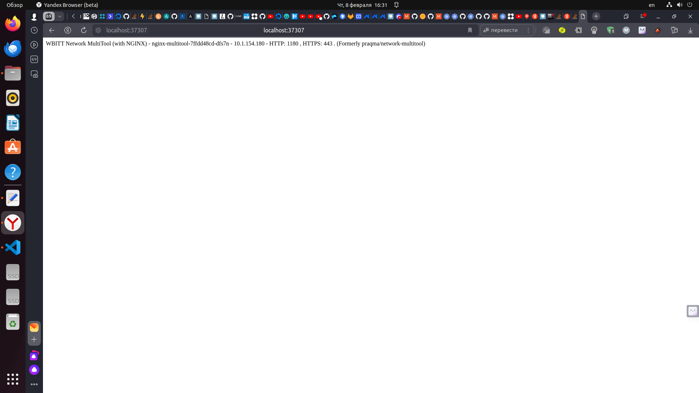

# Домашнее задание к занятию «Запуск приложений в K8S»

### Цель задания

В тестовой среде для работы с Kubernetes, установленной в предыдущем ДЗ, необходимо развернуть Deployment с приложением, состоящим из нескольких контейнеров, и масштабировать его.

------

### Чеклист готовности к домашнему заданию

1. Установленное k8s-решение (например, MicroK8S).
2. Установленный локальный kubectl.
3. Редактор YAML-файлов с подключённым git-репозиторием.

------

### Инструменты и дополнительные материалы, которые пригодятся для выполнения задания

1. [Описание](https://kubernetes.io/docs/concepts/workloads/controllers/deployment/) Deployment и примеры манифестов.
2. [Описание](https://kubernetes.io/docs/concepts/workloads/pods/init-containers/) Init-контейнеров.
3. [Описание](https://github.com/wbitt/Network-MultiTool) Multitool.

------

### Задание 1. Создать Deployment и обеспечить доступ к репликам приложения из другого Pod

1. Создать Deployment приложения, состоящего из двух контейнеров — nginx и multitool. Решить возникшую ошибку.
2. После запуска увеличить количество реплик работающего приложения до 2.
3. Продемонстрировать количество подов до и после масштабирования.
4. Создать Service, который обеспечит доступ до реплик приложений из п.1.
5. Создать отдельный Pod с приложением multitool и убедиться с помощью `curl`, что из пода есть доступ до приложений из п.1.

### Решение 1. Создать Deployment и обеспечить доступ к репликам приложения из другого Pod

1. Создаем Deployment приложения, состоящего из двух контейнеров — nginx и multitool. 
 - nginx работает на 80 порте, в документации multitool написано что если 80 и/или 443 порт занят на хосте, необходимо использовать для multitool 1180 и/или 11443, для работы инструмента multitool прописываем 1180 порт в файле deployment

```
apiVersion: apps/v1
kind: Deployment
metadata:
  name: nginx-multitool
  labels:
    app: nginx
spec:
  replicas: 1
  selector:
    matchLabels:
      app: nginx
  template:
    metadata:
      labels:
        app: nginx
    spec:
      containers:
        - name: nginx
          image: nginx: 1.20
          ports:
            - containerPort: 80
              name: nginx-80
        - name: multitool
          image: wbitt/network-multitool
          env:
            - name: HTTP_PORT
              value: "1180"
          ports:
            - containerPort: 1180
              name: multitool-1180
```
 - запускаем deployment 

<p align="center">
  
</p>

2. Увеличиваем количество реплик до двух

<p align="center">
  
</p>

4. Создаем Service, который обеспечит доступ до реплик приложений из п.1.

```
a: Service
metadata:
  name: netology-svc
spec:
  ports:
    - name: nginx-80
      port: 80
      protocol: TCP
      targetPort: nginx-80
   piVersion: v1
kind - name: multitool-1180
      port: 1180
      protocol: TCP
      targetPort: multitool-1180
  selector:
    app: nginx
```

5. Проверяем работу сервиса и доступность ранее созданных реплик, выполнияем проброс портов командой port-forward

<p align="center">
  
</p>

<p align="center">
  
</p>

 - смотрим доступность реплик в браузере по ссылке localhost:37307

<p align="center">
  
</p>

6. Создаем отдельный Pod с приложением multitool и убеждаемся с помощью `curl`, что из пода есть доступ до приложений из п.1.

```
apiVersion: v1
kind: Pod
metadata:
  name: netology-web
spec:
  containers:
    - image: wbitt/network-multitool
      name: multitool
      env:
        - name: HTTP_PORT
          value: "1188"
      ports:
        - containerPort: 1188
          name: multitool-1188
```
 - выполняем команду `kubectl apply -f ./src/pod.yaml`, проверяем доступность
 
```
aleksander@aleksander-System-Product-Name:~/kuber-homeworks/1.3$ kubectl apply -f ./src/pod.yaml
pod/netology-web created
```
<p align="center">
  
</p>

------

### Задание 2. Создать Deployment и обеспечить старт основного контейнера при выполнении условий

1. Создать Deployment приложения nginx и обеспечить старт контейнера только после того, как будет запущен сервис этого приложения.
2. Убедиться, что nginx не стартует. В качестве Init-контейнера взять busybox.
3. Создать и запустить Service. Убедиться, что Init запустился.
4. Продемонстрировать состояние пода до и после запуска сервиса.

------

### Правила приема работы

1. Домашняя работа оформляется в своем Git-репозитории в файле README.md. Выполненное домашнее задание пришлите ссылкой на .md-файл в вашем репозитории.
2. Файл README.md должен содержать скриншоты вывода необходимых команд `kubectl` и скриншоты результатов.
3. Репозиторий должен содержать файлы манифестов и ссылки на них в файле README.md.

------
