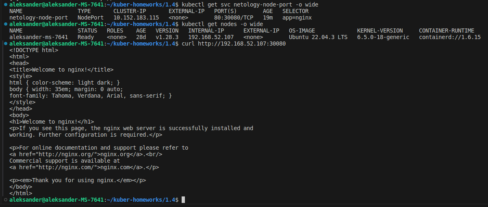

# Домашнее задание к занятию «Сетевое взаимодействие в K8S. Часть 1»

### Цель задания

В тестовой среде Kubernetes необходимо обеспечить доступ к приложению, установленному в предыдущем ДЗ и состоящему из двух контейнеров, по разным портам в разные контейнеры как внутри кластера, так и снаружи.

------

### Чеклист готовности к домашнему заданию

1. Установленное k8s-решение (например, MicroK8S).
2. Установленный локальный kubectl.
3. Редактор YAML-файлов с подключённым Git-репозиторием.

------

### Инструменты и дополнительные материалы, которые пригодятся для выполнения задания

1. [Описание](https://kubernetes.io/docs/concepts/workloads/controllers/deployment/) Deployment и примеры манифестов.
2. [Описание](https://kubernetes.io/docs/concepts/services-networking/service/) Описание Service.
3. [Описание](https://github.com/wbitt/Network-MultiTool) Multitool.

------

### Задание 1. Создать Deployment и обеспечить доступ к контейнерам приложения по разным портам из другого Pod внутри кластера

1. Создать Deployment приложения, состоящего из двух контейнеров (nginx и multitool), с количеством реплик 3 шт.
2. Создать Service, который обеспечит доступ внутри кластера до контейнеров приложения из п.1 по порту 9001 — nginx 80, по 9002 — multitool 8080.
3. Создать отдельный Pod с приложением multitool и убедиться с помощью `curl`, что из пода есть доступ до приложения из п.1 по разным портам в разные контейнеры.
4. Продемонстрировать доступ с помощью `curl` по доменному имени сервиса.
5. Предоставить манифесты Deployment и Service в решении, а также скриншоты или вывод команды п.4.

------

### Задание 2. Создать Service и обеспечить доступ к приложениям снаружи кластера

1. Создать отдельный Service приложения из Задания 1 с возможностью доступа снаружи кластера к nginx, используя тип NodePort.
2. Продемонстрировать доступ с помощью браузера или `curl` с локального компьютера.
3. Предоставить манифест и Service в решении, а также скриншоты или вывод команды п.2.


### Решение 1. Создать Deployment и обеспечить доступ к контейнерам приложения по разным портам из другого Pod внутри кластера

1. Создаем Deployment приложения, состоящего из двух контейнеров (nginx и multitool), с количеством реплик 3 шт.
```
apiVersion: apps/v1
kind: Deployment
metadata:
  name: nginx-multitool
  labels:
    app: nginx
spec:
  replicas: 3
  selector:
    matchLabels:
      app: nginx
  template:
    metadata:
      labels:
        app: nginx
    spec:
      containers:
        - name: nginx
          image: nginx:latest
          ports:
            - containerPort: 80
              name: nginx-80
        - name: multitool
          image: wbitt/network-multitool
          env:
            - name: HTTP_PORT
              value: "8080"
          ports:
            - containerPort: 8080
              name: multitool-8080
```

2. Создаем Service, который обеспечит доступ внутри кластера до контейнеров приложения из п.1 по порту 9001 — nginx 80, по 9002 — multitool 8080.

```
apiVersion: v1
kind: Service
metadata:
  name: netology-svc
spec:
  ports:
    - name: nginx-80
      port: 9001
      protocol: TCP
      targetPort: nginx-80
    - name: multitool-8080
      port: 9002
      protocol: TCP
      targetPort: multitool-8080
  selector:
    app: nginx
```

3. Создаем отдельный Pod с приложением multitool и убеждаемся с помощью `curl`, что из пода есть доступ до приложения из п.1 по разным портам в разные контейнеры.

```
apiVersion: v1
kind: Pod
metadata:
  name: netology-pod
spec:
  containers:
    - image: wbitt/network-multitool
      name: multitool
      env:
        - name: HTTP_PORT
          value: "9003"
      ports:
        - containerPort: 9003
          name: multitool-9003
```


Применяем созданные манифесты и проверяем работу Deployment, Service и Pod

<p align="center">
  
</p>


4. Проверяем доступ с помощью `curl` по доменному имени сервиса к порту 9001 — nginx, по 9002 — multitool.


<p align="center">
  
</p>


### Решение 2. Создать Service и обеспечить доступ к приложениям снаружи кластера

1. Создаем отдельный Service приложения из Задания 1 с возможностью доступа снаружи кластера к nginx, используя тип NodePort.
```
apiVersion: v1
kind: Service
metadata:
  name: netology-node-port
spec:
  ports:
    - name: nginx-80
      port: 80
      protocol: TCP
      nodePort: 30080
  selector:
    app: nginx
  type: NodePort
```

Применяем созданный манифест и проверяем работу Service 

<p align="center">
  
</p>

2. Проверяем доступ с помощью `curl` по ip-адресу ноды и порту NodePort.

<p align="center">
  
</p>

------

### Правила приёма работы

1. Домашняя работа оформляется в своем Git-репозитории в файле README.md. Выполненное домашнее задание пришлите ссылкой на .md-файл в вашем репозитории.
2. Файл README.md должен содержать скриншоты вывода необходимых команд `kubectl` и скриншоты результатов.
3. Репозиторий должен содержать тексты манифестов или ссылки на них в файле README.md.

