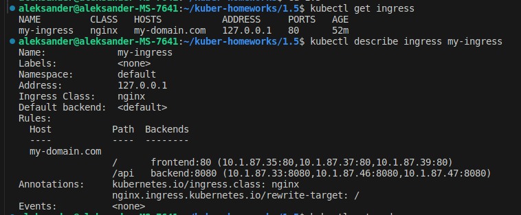

# Домашнее задание к занятию «Сетевое взаимодействие в K8S. Часть 2»

### Цель задания

В тестовой среде Kubernetes необходимо обеспечить доступ к двум приложениям снаружи кластера по разным путям.

------

### Чеклист готовности к домашнему заданию

1. Установленное k8s-решение (например, MicroK8S).
2. Установленный локальный kubectl.
3. Редактор YAML-файлов с подключённым Git-репозиторием.

------

### Инструменты и дополнительные материалы, которые пригодятся для выполнения задания

1. [Инструкция](https://microk8s.io/docs/getting-started) по установке MicroK8S.
2. [Описание](https://kubernetes.io/docs/concepts/services-networking/service/) Service.
3. [Описание](https://kubernetes.io/docs/concepts/services-networking/ingress/) Ingress.
4. [Описание](https://github.com/wbitt/Network-MultiTool) Multitool.

------

### Задание 1. Создать Deployment приложений backend и frontend

1. Создать Deployment приложения _frontend_ из образа nginx с количеством реплик 3 шт.
2. Создать Deployment приложения _backend_ из образа multitool. 
3. Добавить Service, которые обеспечат доступ к обоим приложениям внутри кластера. 
4. Продемонстрировать, что приложения видят друг друга с помощью Service.
5. Предоставить манифесты Deployment и Service в решении, а также скриншоты или вывод команды п.4.

------

### Задание 2. Создать Ingress и обеспечить доступ к приложениям снаружи кластера

1. Включить Ingress-controller в MicroK8S.
2. Создать Ingress, обеспечивающий доступ снаружи по IP-адресу кластера MicroK8S так, чтобы при запросе только по адресу открывался _frontend_ а при добавлении /api - _backend_.
3. Продемонстрировать доступ с помощью браузера или `curl` с локального компьютера.
4. Предоставить манифесты и скриншоты или вывод команды п.2.

------

### Решение 1. Создаем Deployment приложений backend и frontend

1. Создаем Deployment приложения _frontend_ из образа nginx с количеством реплик 3 шт.
```
apiVersion: apps/v1
kind: Deployment
metadata:
  name: frontend
  labels:
    app: frontend
spec:
  replicas: 3
  selector:
    matchLabels:
      app: frontend
  template:
    metadata:
      labels:
        app: frontend
    spec:
      containers:
        - name: nginx
          image: nginx:latest
          ports:
            - containerPort: 80
              name: nginx-80
```

2. Создаем Deployment приложения _backend_ из образа multitool. 
```
apiVersion: apps/v1
kind: Deployment
metadata:
  name: backend
  labels:
    app: backend
spec:
  replicas: 3
  selector:
    matchLabels:
      app: backend
  template:
    metadata:
      labels:
        app: backend
    spec:
      containers:
        - name: multitool
          image: wbitt/network-multitool
          env:
            - name: HTTP_PORT
              value: "8080"
          ports:
            - containerPort: 8080
              name: multitool-8080
```

3. Добавляем Service, которые обеспечат доступ к обоим приложениям внутри кластера.
 - _frontend
```
apiVersion: v1
kind: Service
metadata:
  name: frontend
spec:
  ports:
    - name: nginx-80
      port: 80
      protocol: TCP
      targetPort: nginx-80
  selector:
    app: frontend
```

 - _backend
```
apiVersion: v1
kind: Service
metadata:
  name: backend
spec:
  ports:
    - name: multitool-8080
      port: 8080
      protocol: TCP
      targetPort: multitool-8080
  selector:
    app: backend
```

4. Применяем созданные манифесты и демонстрируем, что приложения видят друг друга с помощью Service.

<p align="center">
  
</p>


### Решение 2. Создаем Ingress и обеспечиваем доступ к приложениям снаружи кластера

1. Включаем Ingress-controller в MicroK8S.

<p align="center">
  
</p>

2. Создаем Ingress, обеспечивающий доступ снаружи по IP-адресу кластера MicroK8S так, чтобы при запросе только по адресу открывался _frontend_ а при добавлении /api - _backend_.
```
apiVersion: networking.k8s.io/v1
kind: Ingress
metadata:
  name: my-ingress
  annotations:
    kubernetes.io/ingress.class: nginx
    nginx.ingress.kubernetes.io/rewrite-target: /
spec:
  ingressClassName: "nginx"
  rules:
    - host: my-domain.com
      http:
        paths:
          - path: /
            pathType: Prefix
            backend:
              service:
                name: frontend
                port:
                  number: 80
          - path: /api
            pathType: Prefix
            backend:
              service:
                name: backend
                port:
                  number: 8080
```


3. Продемонстрировать доступ с помощью браузера или `curl` с локального компьютера.

 - проверяем созданный ingress
 <p align="center">
  
</p>

 - проверяем доступ с помощью `curl`
 
```
aleksander@aleksander-MS-7641:~/kuber-homeworks/1.5$ curl my-domain.com
<!DOCTYPE html>
<html>
   <head>
      <title>Welcome to NGINX Unit!</title>
      <style>
         body {
         width: 35em;
         margin: 0 auto;
         font-family: Tahoma, Verdana, Arial, sans-serif;
         }
      </style>
   </head>
   <body>
      <h1>Welcome to NGINX Unit!</h1>
      <p>If you see this page, the NGINX Unit web server is successfully
         installed and working.  Further configuration is required.
      </p>
      <p>For online documentation and support, please refer to
         <a href="https://unit.nginx.org/">unit.nginx.org</a>.<br/>
      </p>
      <p><em>Thank you for using NGINX Unit.</em></p>
   </body>
</html>
aleksander@aleksander-MS-7641:~/kuber-homeworks/1.5$ curl my-domain.com/app
WBITT Network MultiTool (with NGINX) - backend-66685bfc4d-lnfr6 - 10.1.87.47 - HTTP: 8080 , HTTPS: 443 . (Formerly praqma/network-multitool)
```

### Правила приема работы

1. Домашняя работа оформляется в своем Git-репозитории в файле README.md. Выполненное домашнее задание пришлите ссылкой на .md-файл в вашем репозитории.
2. Файл README.md должен содержать скриншоты вывода необходимых команд `kubectl` и скриншоты результатов.
3. Репозиторий должен содержать тексты манифестов или ссылки на них в файле README.md.

------
