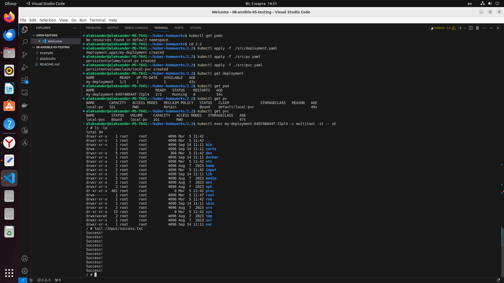
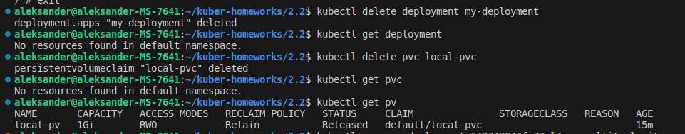
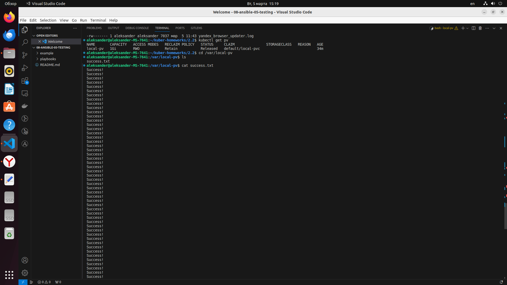

# Домашнее задание к занятию «Хранение в K8s. Часть 2»

### Цель задания

В тестовой среде Kubernetes нужно создать PV и продемострировать запись и хранение файлов.

------

### Чеклист готовности к домашнему заданию

1. Установленное K8s-решение (например, MicroK8S).
2. Установленный локальный kubectl.
3. Редактор YAML-файлов с подключенным GitHub-репозиторием.

------

### Дополнительные материалы для выполнения задания

1. [Инструкция по установке NFS в MicroK8S](https://microk8s.io/docs/nfs). 
2. [Описание Persistent Volumes](https://kubernetes.io/docs/concepts/storage/persistent-volumes/). 
3. [Описание динамического провижининга](https://kubernetes.io/docs/concepts/storage/dynamic-provisioning/). 
4. [Описание Multitool](https://github.com/wbitt/Network-MultiTool).

------

### Задание 1

**Что нужно сделать**

Создать Deployment приложения, использующего локальный PV, созданный вручную.

1. Создать Deployment приложения, состоящего из контейнеров busybox и multitool.
2. Создать PV и PVC для подключения папки на локальной ноде, которая будет использована в поде.
3. Продемонстрировать, что multitool может читать файл, в который busybox пишет каждые пять секунд в общей директории. 
4. Удалить Deployment и PVC. Продемонстрировать, что после этого произошло с PV. Пояснить, почему.
5. Продемонстрировать, что файл сохранился на локальном диске ноды. Удалить PV.  Продемонстрировать что произошло с файлом после удаления PV. Пояснить, почему.
5. Предоставить манифесты, а также скриншоты или вывод необходимых команд.

------

### Задание 2

**Что нужно сделать**

Создать Deployment приложения, которое может хранить файлы на NFS с динамическим созданием PV.

1. Включить и настроить NFS-сервер на MicroK8S.
2. Создать Deployment приложения состоящего из multitool, и подключить к нему PV, созданный автоматически на сервере NFS.
3. Продемонстрировать возможность чтения и записи файла изнутри пода. 
4. Предоставить манифесты, а также скриншоты или вывод необходимых команд.


### Решение 1

1. Создаем Deployment приложения, состоящего из контейнеров busybox и multitool.

```
apiVersion: apps/v1
kind: Deployment
metadata:
  name: my-deployment
spec:
  replicas: 1
  selector:
    matchLabels:
      app: my-deployment
  template:
    metadata:
      labels:
        app: my-deployment
    spec:
      containers:
      - name: busybox
        image: busybox
        command: ['sh', '-c', 'while true; do echo "Success!" >> /output/success.txt; sleep 5; done']
        volumeMounts:
          - name: storage
            mountPath: /output
      - name: multitool
        image: wbitt/network-multitool
        volumeMounts:
          - name: storage
            mountPath: /output
      volumes:
      - name: storage
        persistentVolumeClaim: 
          claimName: local-pvc
```

2. Создаем PV и PVC для подключения папки на локальной ноде, которая будет использована в поде.

```
apiVersion: v1
kind: PersistentVolume
metadata:
  name: local-pv
spec:
  capacity:
    storage: 1Gi
  accessModes:
    - ReadWriteOnce
  hostPath:
    path: /var/local-pv
```

```
apiVersion: v1
kind: PersistentVolumeClaim
metadata:
  name: local-pvc
spec:
  accessModes:
    - ReadWriteOnce
  resources:
    requests:
      storage: 1Gi
```

3. Демонстрируем, что multitool может читать файл, в который busybox пишет каждые пять секунд в общей директории. 

<p align="center">
  
</p>

4. Удаляем Deployment и PVC. После этого состояние PV изменилось на "Released", то есть PV больше не привязан к какому-либо PVC и доступен для повторного использования.

<p align="center">
  
</p>

5. Файл сохранился на локальном диске ноды. Удаляем PV.  После удаления PV с помощью команды kubectl delete pv local-pv, файл success.txt остается на локальном диске ноды. Это происходит потому, что PV в Kubernetes управляет только ресурсами хранилища в кластере, но не управляет данными, которые могут храниться внутри него. Удаление PV просто освобождает ресурсы, занимаемые PV в кластере, но не затрагивает данные, которые были сохранены на узле хоста. 

<p align="center">
  
</p>

### Решение 2


1. Включить и настроить NFS-сервер на MicroK8S.


2. Создать Deployment приложения состоящего из multitool, и подключить к нему PV, созданный автоматически на сервере NFS.
3. Продемонстрировать возможность чтения и записи файла изнутри пода. 
4. Предоставить манифесты, а также скриншоты или вывод необходимых команд.


------

### Правила приёма работы

1. Домашняя работа оформляется в своём Git-репозитории в файле README.md. Выполненное задание пришлите ссылкой на .md-файл в вашем репозитории.
2. Файл README.md должен содержать скриншоты вывода необходимых команд `kubectl`, а также скриншоты результатов.
3. Репозиторий должен содержать тексты манифестов или ссылки на них в файле README.md.
