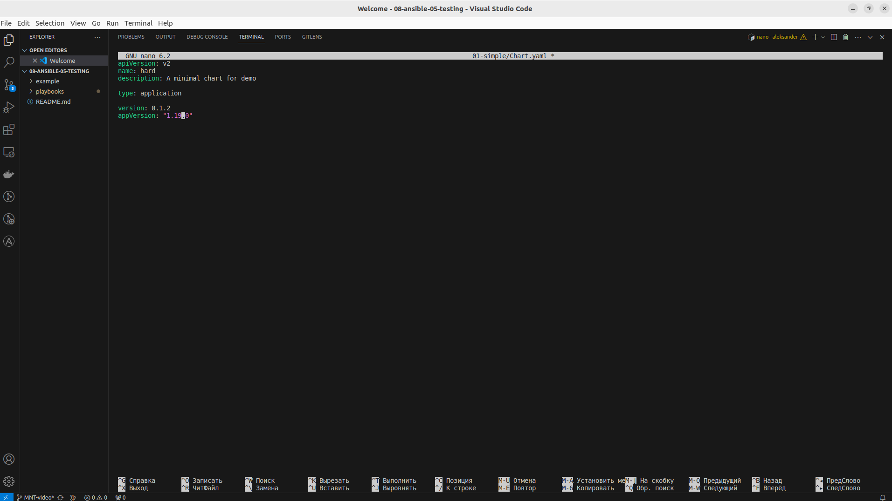
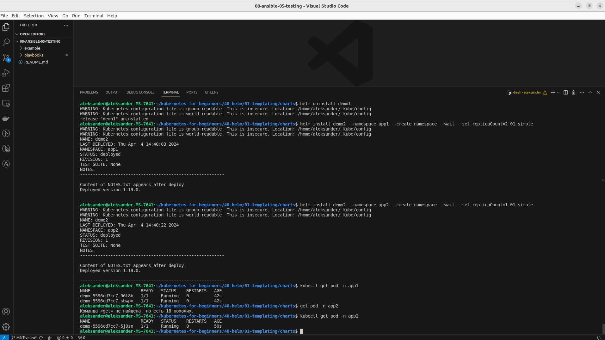

# Домашнее задание к занятию «Helm»

### Цель задания

В тестовой среде Kubernetes необходимо установить и обновить приложения с помощью Helm.

------

### Чеклист готовности к домашнему заданию

1. Установленное k8s-решение, например, MicroK8S.
2. Установленный локальный kubectl.
3. Установленный локальный Helm.
4. Редактор YAML-файлов с подключенным репозиторием GitHub.

------

### Инструменты и дополнительные материалы, которые пригодятся для выполнения задания

1. [Инструкция](https://helm.sh/docs/intro/install/) по установке Helm. [Helm completion](https://helm.sh/docs/helm/helm_completion/).

------

### Задание 1. Подготовить Helm-чарт для приложения

1. Необходимо упаковать приложение в чарт для деплоя в разные окружения. 
2. Каждый компонент приложения деплоится отдельным deployment’ом или statefulset’ом.
3. В переменных чарта измените образ приложения для изменения версии.

------
### Задание 2. Запустить две версии в разных неймспейсах

1. Подготовив чарт, необходимо его проверить. Запуститe несколько копий приложения.
2. Одну версию в namespace=app1, вторую версию в том же неймспейсе, третью версию в namespace=app2.
3. Продемонстрируйте результат.


###  Решение 1

 - Скачиваем файлы для подготовки деплоя
 
```
aleksander@aleksander-MS-7641:~$  git clone https://github.com/aak74/kubernetes-for-beginners.git
Клонирование в «kubernetes-for-beginners»...
remote: Enumerating objects: 983, done.
remote: Counting objects: 100% (236/236), done.
remote: Compressing objects: 100% (173/173), done.
remote: Total 983 (delta 72), reused 173 (delta 45), pack-reused 747
Получение объектов: 100% (983/983), 2.64 МиБ | 2.37 МиБ/с, готово.
Определение изменений: 100% (362/362), готово.
```
 - Создаем шаблон на базе данных файлов

```
aleksander@aleksander-MS-7641:~/kubernetes-for-beginners/40-helm/01-templating/charts$ helm template 01-simple
WARNING: Kubernetes configuration file is group-readable. This is insecure. Location: /home/aleksander/.kube/config
WARNING: Kubernetes configuration file is world-readable. This is insecure. Location: /home/aleksander/.kube/config
---
# Source: hard/templates/service.yaml
apiVersion: v1
kind: Service
metadata:
  name: demo
  labels:
    app: demo
spec:
  ports:
    - port: 80
      name: http
  selector:
    app: demo
---
# Source: hard/templates/deployment.yaml
apiVersion: apps/v1
kind: Deployment
metadata:
  name: demo
  labels:
    app: demo
spec:
  replicas: 1
  selector:
    matchLabels:
      app: demo
  template:
    metadata:
      labels:
        app: demo
    spec:
      containers:
        - name: hard
          image: "nginx:1.16.0"
          imagePullPolicy: IfNotPresent
          ports:
            - name: http
              containerPort: 80
              protocol: TCP
          resources:
            limits:
              cpu: 200m
              memory: 256Mi
            requests:
              cpu: 100m
              memory: 128Mi
```

Получаем что helm при запуске создаст service(port 80) и deployment(nginx version 1.16.0)

 - В переменных чарта меняем образ приложения
 

```
aleksander@aleksander-MS-7641:~/kubernetes-for-beginners/40-helm/01-templating/charts$ nano 01-simple/Chart.yaml
```

<p align="center">
  
</p> 

```
aleksander@aleksander-MS-7641:~/kubernetes-for-beginners/40-helm/01-templating/charts$ cat 01-simple/Chart.yaml
apiVersion: v2
name: hard
description: A minimal chart for demo

type: application

version: 0.1.2
appVersion: "1.19.0"
```

 - Проверяем изменения в шаблоне

```
aleksander@aleksander-MS-7641:~/kubernetes-for-beginners/40-helm/01-templating/charts$ helm template 01-simple
WARNING: Kubernetes configuration file is group-readable. This is insecure. Location: /home/aleksander/.kube/config
WARNING: Kubernetes configuration file is world-readable. This is insecure. Location: /home/aleksander/.kube/config
---
# Source: hard/templates/service.yaml
apiVersion: v1
kind: Service
metadata:
  name: demo
  labels:
    app: demo
spec:
  ports:
    - port: 80
      name: http
  selector:
    app: demo
---
# Source: hard/templates/deployment.yaml
apiVersion: apps/v1
kind: Deployment
metadata:
  name: demo
  labels:
    app: demo
spec:
  replicas: 1
  selector:
    matchLabels:
      app: demo
  template:
    metadata:
      labels:
        app: demo
    spec:
      containers:
        - name: hard
          image: "nginx:1.19.0"
          imagePullPolicy: IfNotPresent
          ports:
            - name: http
              containerPort: 80
              protocol: TCP
          resources:
            limits:
              cpu: 200m
              memory: 256Mi
            requests:
              cpu: 100m
              memory: 128Mi
```


###  Решение 2


1. Проверяем созданный чарт. 

```
aleksander@aleksander-MS-7641:~/kubernetes-for-beginners/40-helm/01-templating/charts$ helm install demo1 01-simple
WARNING: Kubernetes configuration file is group-readable. This is insecure. Location: /home/aleksander/.kube/config
WARNING: Kubernetes configuration file is world-readable. This is insecure. Location: /home/aleksander/.kube/config
NAME: demo1
LAST DEPLOYED: Thu Apr  4 14:25:28 2024
NAMESPACE: default
STATUS: deployed
REVISION: 1
TEST SUITE: None
NOTES:
---------------------------------------------------------

Content of NOTES.txt appears after deploy.
Deployed version 1.19.0.

---------------------------------------------------------
aleksander@aleksander-MS-7641:~/kubernetes-for-beginners/40-helm/01-templating/charts$ kubectl get all
NAME                        READY   STATUS              RESTARTS   AGE
pod/demo-5596cd7cc7-h82mn   0/1     ContainerCreating   0          16s

NAME                 TYPE        CLUSTER-IP      EXTERNAL-IP   PORT(S)   AGE
service/demo         ClusterIP   10.152.183.68   <none>        80/TCP    17s
service/kubernetes   ClusterIP   10.152.183.1    <none>        443/TCP   161m

NAME                   READY   UP-TO-DATE   AVAILABLE   AGE
deployment.apps/demo   0/1     1            0           17s

NAME                              DESIRED   CURRENT   READY   AGE
replicaset.apps/demo-5596cd7cc7   1         1         0       17s
aleksander@aleksander-MS-7641:~/kubernetes-for-beginners/40-helm/01-templating/charts$ helm list
WARNING: Kubernetes configuration file is group-readable. This is insecure. Location: /home/aleksander/.kube/config
WARNING: Kubernetes configuration file is world-readable. This is insecure. Location: /home/aleksander/.kube/config
NAME    NAMESPACE       REVISION        UPDATED                                 STATUS          CHART           APP VERSION
demo1   default         1               2024-04-04 14:25:28.154973904 +0300 MSK deployed        hard-0.1.2      1.19.0  
```

2. Запускаем несколько копий приложения.

```
aleksander@aleksander-MS-7641:~/kubernetes-for-beginners/40-helm/01-templating/charts$ helm upgrade demo1 --set replicaCount=3 01-simple
WARNING: Kubernetes configuration file is group-readable. This is insecure. Location: /home/aleksander/.kube/config
WARNING: Kubernetes configuration file is world-readable. This is insecure. Location: /home/aleksander/.kube/config
Release "demo1" has been upgraded. Happy Helming!
NAME: demo1
LAST DEPLOYED: Thu Apr  4 14:34:53 2024
NAMESPACE: default
STATUS: deployed
REVISION: 2
TEST SUITE: None
NOTES:
---------------------------------------------------------

Content of NOTES.txt appears after deploy.
Deployed version 1.19.0.

---------------------------------------------------------
aleksander@aleksander-MS-7641:~/kubernetes-for-beginners/40-helm/01-templating/charts$ helm list
WARNING: Kubernetes configuration file is group-readable. This is insecure. Location: /home/aleksander/.kube/config
WARNING: Kubernetes configuration file is world-readable. This is insecure. Location: /home/aleksander/.kube/config
NAME    NAMESPACE       REVISION        UPDATED                                 STATUS          CHART           APP VERSION
demo1   default         2               2024-04-04 14:34:53.091466418 +0300 MSK deployed        hard-0.1.2      1.19.0     
aleksander@aleksander-MS-7641:~/kubernetes-for-beginners/40-helm/01-templating/charts$ kubectl get pod
NAME                    READY   STATUS    RESTARTS   AGE
demo-5596cd7cc7-9d8sk   1/1     Running   0          28s
demo-5596cd7cc7-h82mn   1/1     Running   0          9m51s
demo-5596cd7cc7-wfbhc   1/1     Running   0          28s
```

 - Удаляем созданное ранее приложение helm demo1 и создаем одну версию в namespace=app1, вторую версию в том же неймспейсе, третью версию в namespace=app2

<p align="center">
  
</p> 

### Правила приёма работы

1. Домашняя работа оформляется в своём Git репозитории в файле README.md. Выполненное домашнее задание пришлите ссылкой на .md-файл в вашем репозитории.
2. Файл README.md должен содержать скриншоты вывода необходимых команд `kubectl`, `helm`, а также скриншоты результатов.
3. Репозиторий должен содержать тексты манифестов или ссылки на них в файле README.md.

