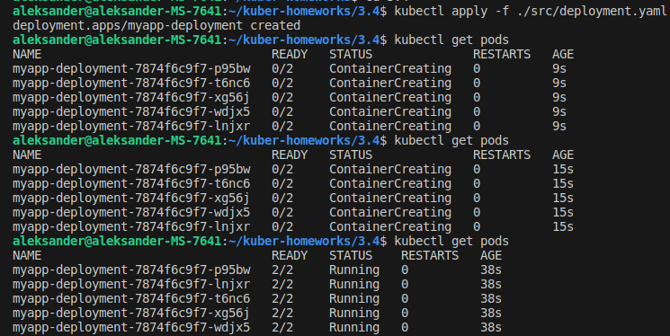
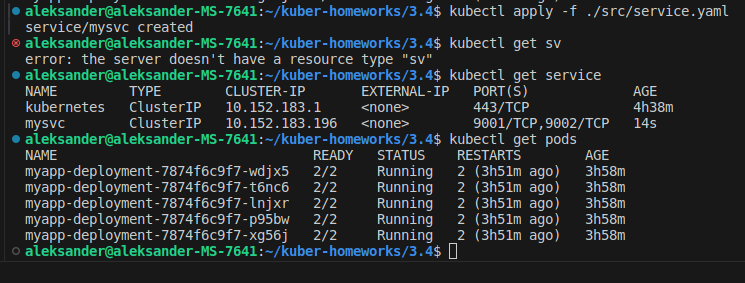
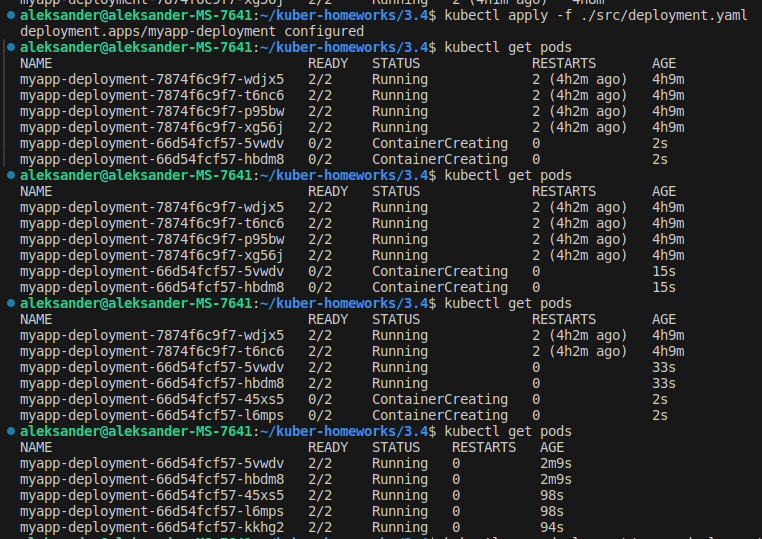
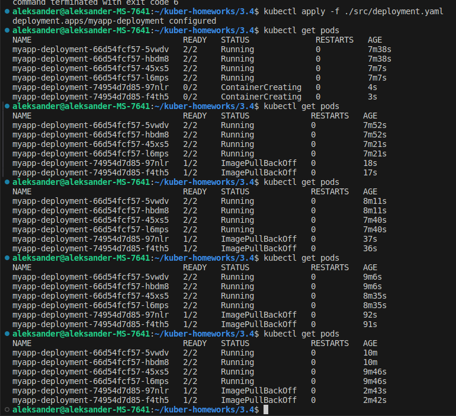
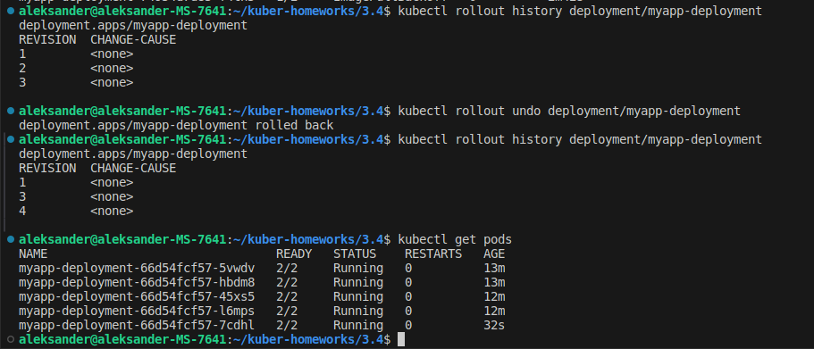

# Домашнее задание к занятию «Обновление приложений»

### Цель задания

Выбрать и настроить стратегию обновления приложения.

### Чеклист готовности к домашнему заданию

1. Кластер K8s.

### Инструменты и дополнительные материалы, которые пригодятся для выполнения задания

1. [Документация Updating a Deployment](https://kubernetes.io/docs/concepts/workloads/controllers/deployment/#updating-a-deployment).
2. [Статья про стратегии обновлений](https://habr.com/ru/companies/flant/articles/471620/).

-----

### Задание 1. Выбрать стратегию обновления приложения и описать ваш выбор

1. Имеется приложение, состоящее из нескольких реплик, которое требуется обновить.
2. Ресурсы, выделенные для приложения, ограничены, и нет возможности их увеличить.
3. Запас по ресурсам в менее загруженный момент времени составляет 20%.
4. Обновление мажорное, новые версии приложения не умеют работать со старыми.
5. Вам нужно объяснить свой выбор стратегии обновления приложения.

### Задание 2. Обновить приложение

1. Создать deployment приложения с контейнерами nginx и multitool. Версию nginx взять 1.19. Количество реплик — 5.
2. Обновить версию nginx в приложении до версии 1.20, сократив время обновления до минимума. Приложение должно быть доступно.
3. Попытаться обновить nginx до версии 1.28, приложение должно оставаться доступным.
4. Откатиться после неудачного обновления.

## Дополнительные задания — со звёздочкой*

Задания дополнительные, необязательные к выполнению, они не повлияют на получение зачёта по домашнему заданию. **Но мы настоятельно рекомендуем вам выполнять все задания со звёздочкой.** Это поможет лучше разобраться в материале.   

### Задание 3*. Создать Canary deployment

1. Создать два deployment'а приложения nginx.
2. При помощи разных ConfigMap сделать две версии приложения — веб-страницы.
3. С помощью ingress создать канареечный деплоймент, чтобы можно было часть трафика перебросить на разные версии приложения.

### Решение 1. Выбрать стратегию обновления приложения и описать ваш выбор

Если приложение уже протестировано ранее, то лучшим вариантом будет использовать стратегию обновления Rolling Update, указанием параметров maxSurge maxUnavailable для избежания ситуации с нехваткой ресурсов. Проводить обновление следует в менее загруженный момент времени сервиса. При данной стратегии(Rolling Update) k8s постепенно заменит все поды без ущерба производительности. И если что-то пойдет не так, можно будет быстро откатится к предыдущему состоянию.
Также можно использовать Canary Strategy, указав параметры maxSurge maxUnavailable чтобы избежать нехватки ресурсов. Это позволит протестировать новую версию программы на реальной пользовательской базе(группа может выделяться по определенному признаку) без обязательства полного развертывания. После тестирования и собирания метрик пользователей можно постепенно переводить поды к новой версии приложения.


### Решение 2. Обновить приложение

1. Создаем deployment приложения с контейнерами nginx и multitool. Версию nginx берем 1.19. Количество реплик — 5.
```
apiVersion: apps/v1
kind: Deployment
metadata:
  name: myapp-deployment
  labels:
    app: myapp-pod
spec:
  replicas: 5
  selector:
    matchLabels:
      app: myapp-pod
  template:
    metadata:
      labels:
        app: myapp-pod
    spec:
      containers:
      - name: nginx-container
        image: nginx:1.19
        ports:
          - containerPort: 80
        env:
          - name: NGINX_PORT
            value: "80"
          - name: NGINX_LISTEN
            value: "0.0.0.0"
      - name: multitool-container
        image: wbitt/network-multitool
        ports: 
          - containerPort: 8080
            name: http-port
        env:
          - name: HTTP_PORT
            value: "8080"
```
 - создаем service
```
apiVersion: v1
kind: Service
metadata:
  name: mysvc
spec:
  ports:
    - name: web-nginx
      port: 9001
      targetPort: 80
    - name: web-mtools
      port: 9002
      targetPort: 8080
  selector:
    app: myapp-pod
```

<p align="center">
  
</p> 
<p align="center">
  
</p>

2. Обновляем версию nginx в приложении до версии 1.20, сократив время обновления до минимума. 
 - Меняем в deployment.yaml параметр image: nginx:1.19 на 1.20
 - добавляем RollingUpdate

```
strategy:
    type: RollingUpdate
    rollingUpdate:
      maxSurge: 1
      maxUnavailable: 1
```

```
apiVersion: apps/v1
kind: Deployment
metadata:
  name: myapp-deployment
  labels:
    app: myapp-pod
spec:
  replicas: 5
  selector:
    matchLabels:
      app: myapp-pod
  strategy:
    type: RollingUpdate
    rollingUpdate:
      maxSurge: 1
      maxUnavailable: 1
  template:
    metadata:
      labels:
        app: myapp-pod
    spec:
      containers:
      - name: nginx-container
        image: nginx:1.19
        ports:
          - containerPort: 80
        env:
          - name: NGINX_PORT
            value: "80"
          - name: NGINX_LISTEN
            value: "0.0.0.0"
      - name: multitool-container
        image: wbitt/network-multitool
        ports: 
          - containerPort: 8080
            name: http-port
        env:
          - name: HTTP_PORT
            value: "8080"
```
 - выполняем обновление
<p align="center">
  
</p> 
 
3. Пытаемся обновить nginx до версии 1.28, приложение должно оставаться доступным.
 - в результате получаем ошибки запуска некоторых pod'ов, Kubernetes не может получить образ для некоторых контейнеров pod'а
<p align="center">
  
</p> 
4. Откатываемся после неудачного обновления, проверяем доступность pod'ов.
<p align="center">
  
</p> 

 
### Правила приёма работы

1. Домашняя работа оформляется в своем Git-репозитории в файле README.md. Выполненное домашнее задание пришлите ссылкой на .md-файл в вашем репозитории.
2. Файл README.md должен содержать скриншоты вывода необходимых команд, а также скриншоты результатов.
3. Репозиторий должен содержать тексты манифестов или ссылки на них в файле README.md.
