# Домашнее задание к занятию Troubleshooting

### Цель задания

Устранить неисправности при деплое приложения.

### Чеклист готовности к домашнему заданию

1. Кластер K8s.

### Задание. При деплое приложение web-consumer не может подключиться к auth-db. Необходимо это исправить

1. Установить приложение по команде:
```shell
kubectl apply -f https://raw.githubusercontent.com/netology-code/kuber-homeworks/main/3.5/files/task.yaml
```
2. Выявить проблему и описать.
3. Исправить проблему, описать, что сделано.
4. Продемонстрировать, что проблема решена.


### Решение. 

1. Устанавливаем приложение по команде: `kubectl apply -f https://raw.githubusercontent.com/netology-code/kuber-homeworks/main/3.5/files/task.yaml`
 - получаем ошибки `namespaces "web" not found` и `namespaces "data" not found`
 - создаем данные namespace и пробуем установить приложение снова, приложение устанавливается успешно
 
<p align="center">
  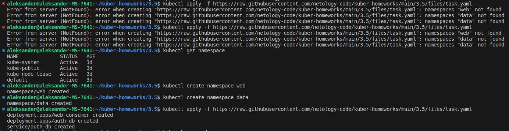
</p>

 - проверяем работу
 
<p align="center">
  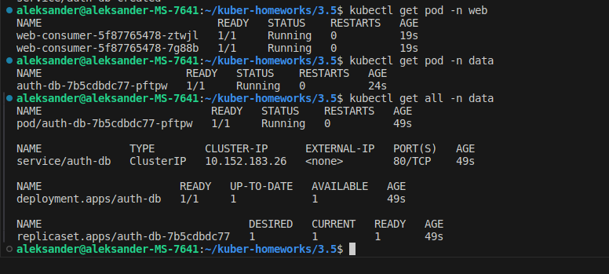
</p>

Смотрим логи созданных приложений

<p align="center">
  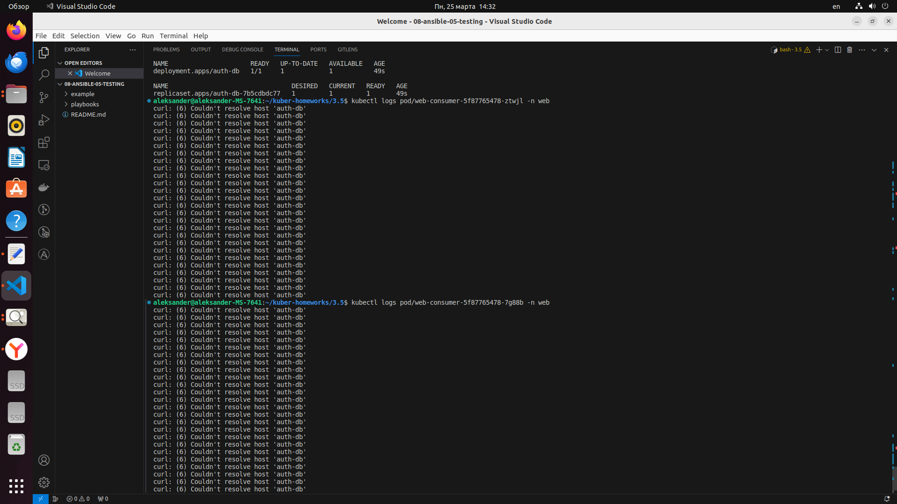
</p>

<p align="center">
  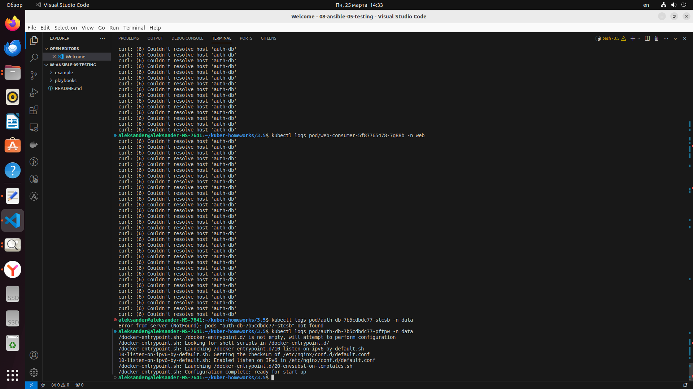
</p>

 - видим что pod-ы `web-consumer` не могут подключиться к host-у по имени 'auth-db'
 
Проверим есть ли доступ к приложению 'auth-db' из контейнера web-consumer через ip-адрес 10.152.183.33

<p align="center">
  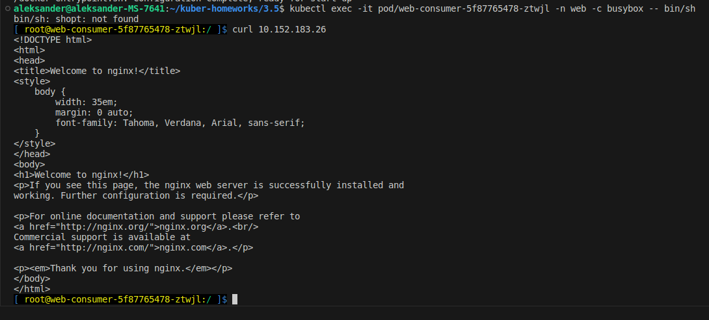
</p>

 - видим что доступ по ip-адресу 10.152.183.26 есть
 - значит проблема в том что в конфигурации хостов в pod-ах не прописан хост 'auth-db' (не сопоставлен с ip-адресом)

<p align="center">
  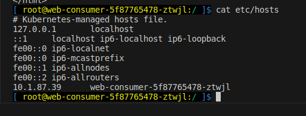
</p>

 - прописываем сопоставление `ip-адреса` с именем `auth-db` командой `echo "10.252.183.26   auth-db" >> etc/hosts`

<p align="center">
  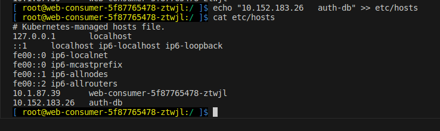
</p>

 - проверяем доступность, после выполнения предыдущего шага доступ к `auth-db` появился

<p align="center">
  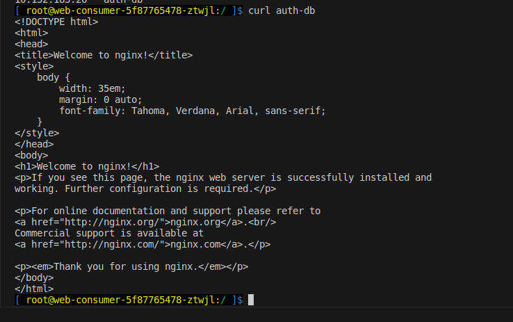
</p>

Для того, чтобы при рестарте контейнера все заново не пришлось править (адрес изменится и потеряется слой с изменениями файла хостс) внесем изменение в манифест деплоймента.
 - проеряем `ip-адрес` кластера `auth-db`
 
<p align="center">
  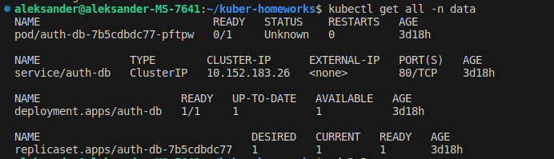
</p> 

 - добавляем в манифест `Deployment` `web-consumer` дополнительную запись с помощью `hostAliases`
```
apiVersion: apps/v1
kind: Deployment
metadata:
  name: web-consumer
  namespace: web
spec:
  replicas: 2
  selector:
    matchLabels:
      app: web-consumer
  template:
    metadata:
      labels:
        app: web-consumer
    spec:
      hostAliases:
      - ip: "10.152.183.26"
        hostnames:
        - "auth-db"
      containers:
      - command:
        - sh
        - -c
        - while true; do curl auth-db; sleep 5; done
        image: radial/busyboxplus:curl
        name: busybox
```

 - проверяем в конфигурации хостов в pod-ах что прописан хост 'auth-db' 

<p align="center">
  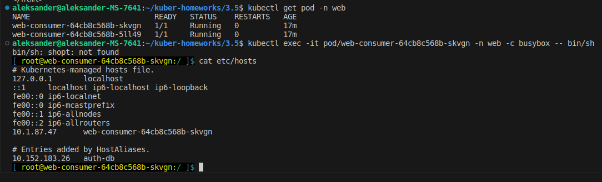
</p> 

 - смотрим логи созданных приложений

<p align="center">
  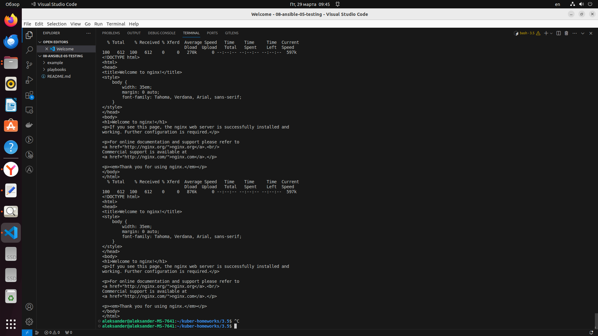
</p> 

Видим что хост 'auth-db' доступен

### Правила приёма работы

1. Домашняя работа оформляется в своём Git-репозитории в файле README.md. Выполненное домашнее задание пришлите ссылкой на .md-файл в вашем репозитории.
2. Файл README.md должен содержать скриншоты вывода необходимых команд, а также скриншоты результатов.
3. Репозиторий должен содержать тексты манифестов или ссылки на них в файле README.md.
